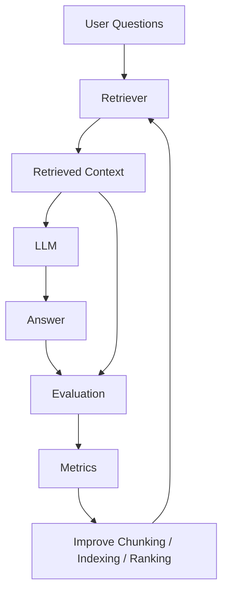

# RAG Evaluation Loop

A production RAG system needs continuous evaluation across retrieval, context quality, and answer quality.

## Diagram

## Metrics

- Retrieval precision
- Retrieval recall
- Context relevance
- Groundedness
- Faithfulness
- Answer relevance
- Citation accuracy
