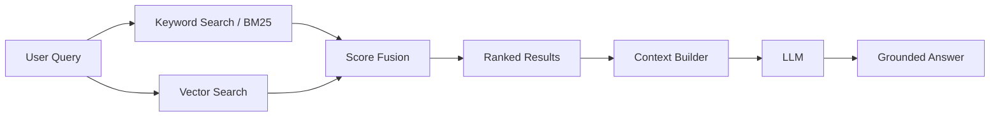

# Hybrid Search Pattern

Hybrid Search combines keyword-based retrieval with vector similarity search to improve recall and precision.

## When to Use

- Enterprise documents contain acronyms, product names, policy numbers, and domain-specific keywords.
- Semantic search alone misses exact matches.
- Keyword search alone misses conceptual matches.

## Diagram

## Implementation Notes

- Use BM25 for exact term recall.
- Use embeddings for semantic recall.
- Fuse scores with weighted ranking or reciprocal rank fusion.
- Preserve metadata for filtering and citations.
