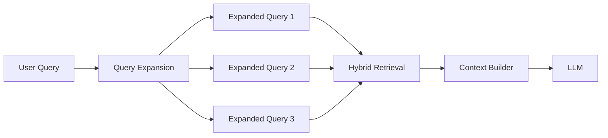

# Query Expansion Pattern

Query Expansion rewrites or expands user questions into multiple stronger retrieval queries.

## When to Use

- Users ask vague or incomplete questions.
- Domain terminology differs across documents.
- You need better recall across synonyms, acronyms, and related concepts.

## Diagram

