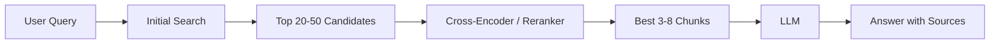

# Reranking Pattern

Reranking improves the quality of retrieved chunks before sending context to the LLM.

## When to Use

- Initial search returns many moderately relevant documents.
- The top results are noisy.
- You need higher answer precision without increasing prompt size.

## Diagram

## Implementation Notes

- Retrieve broad, then rerank narrow.
- Track reranker latency separately.
- Evaluate reranked precision against baseline retrieval.
